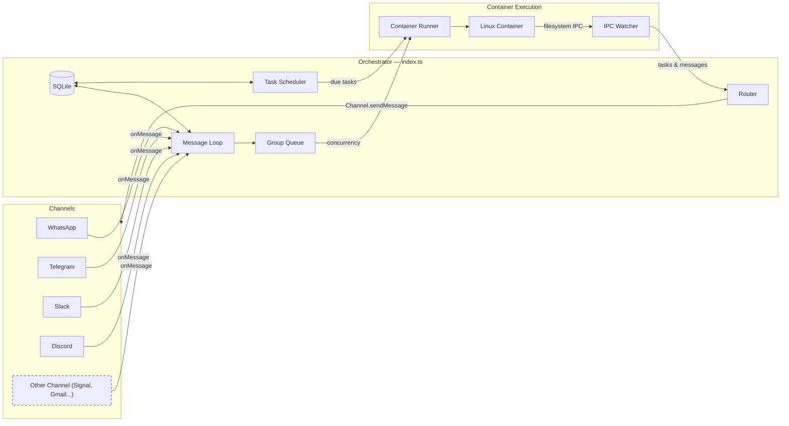

# NanoClaw Specification

A personal Claude assistant with multi-channel support, persistent memory per conversation, scheduled tasks, and container-isolated agent execution.

---

## Table of Contents

1. [Architecture](#architecture)
2. [Architecture: Channel System](#architecture-channel-system)
3. [Folder Structure](#folder-structure)
4. [Configuration](#configuration)
5. [Memory System](#memory-system)
6. [Session Management](#session-management)
7. [Message Flow](#message-flow)
8. [Commands](#commands)
9. [Scheduled Tasks](#scheduled-tasks)
10. [MCP Servers](#mcp-servers)
11. [Deployment](#deployment)
12. [Security Considerations](#security-considerations)

---

## Architecture

```
┌──────────────────────────────────────────────────────────────────────┐
│                        HOST (macOS / Linux)                           │
│                     (Main Node.js Process)                            │
├──────────────────────────────────────────────────────────────────────┤
│                                                                       │
│  ┌──────────────────┐                  ┌────────────────────┐        │
│  │ Channels         │─────────────────▶│   SQLite Database  │        │
│  │ (self-register   │◀────────────────│   (messages.db)    │        │
│  │  at startup)     │  store/send      └─────────┬──────────┘        │
│  └──────────────────┘                            │                   │
│                                                   │                   │
│         ┌─────────────────────────────────────────┘                   │
│         │                                                             │
│         ▼                                                             │
│  ┌──────────────────┐    ┌──────────────────┐    ┌───────────────┐   │
│  │  Message Loop    │    │  Scheduler Loop  │    │  IPC Watcher  │   │
│  │  (polls SQLite)  │    │  (checks tasks)  │    │  (file-based) │   │
│  └────────┬─────────┘    └────────┬─────────┘    └───────────────┘   │
│           │                       │                                   │
│           └───────────┬───────────┘                                   │
│                       │ spawns container                              │
│                       ▼                                               │
├──────────────────────────────────────────────────────────────────────┤
│                     CONTAINER (Linux VM)                               │
├──────────────────────────────────────────────────────────────────────┤
│  ┌──────────────────────────────────────────────────────────────┐    │
│  │                    AGENT RUNNER                               │    │
│  │                                                                │    │
│  │  Working directory: /workspace/group (mounted from host)       │    │
│  │  Volume mounts:                                                │    │
│  │    • groups/{name}/ → /workspace/group                         │    │
│  │    • data/sessions/{group}/.claude/ → /home/node/.claude/      │    │
│  │    • Additional dirs → /workspace/extra/*                      │    │
│  │                                                                │    │
│  │  Tools (configurable per-group via allowedTools):               │    │
│  │    • Bash (safe - sandboxed in container!)                     │    │
│  │    • Read, Write, Edit, Glob, Grep (file operations)           │    │
│  │    • WebSearch, WebFetch (internet access)                     │    │
│  │    • agent-browser (only if skill explicitly allowed)          │    │
│  │    • mcp__nanoclaw__* (scheduler tools via IPC — always on)    │    │
│  │    • Per-group MCP servers (e.g. brave-search, nanoclaw-web-search)  │    │
│  │                                                                │    │
│  └──────────────────────────────────────────────────────────────┘    │
│                                                                       │
└───────────────────────────────────────────────────────────────────────┘
```

### Technology Stack

| Component | Technology | Purpose |
|-----------|------------|---------|
| Channel System | Channel registry (`src/channels/registry.ts`) | Channels self-register at startup |
| Message Storage | SQLite (better-sqlite3) | Store messages for polling |
| Container Runtime | Containers (Linux VMs) | Isolated environments for agent execution |
| Agent | @anthropic-ai/claude-agent-sdk (0.2.29) | Run Claude with tools and MCP servers |
| Browser Automation | agent-browser + Chromium | Web interaction and screenshots |
| Runtime | Node.js 20+ | Host process for routing and scheduling |

---

## Architecture: Channel System

The core ships with no channels built in — each channel (WhatsApp, Telegram, Slack, Discord, Gmail) is installed as a [Claude Code skill](https://code.claude.com/docs/en/skills) that adds the channel code to your fork. Channels self-register at startup; installed channels with missing credentials emit a WARN log and are skipped.

### System Diagram



### Channel Registry

The channel system is built on a factory registry in `src/channels/registry.ts`:

```typescript
export type ChannelFactory = (opts: ChannelOpts) => Channel | null;

const registry = new Map<string, ChannelFactory>();

export function registerChannel(name: string, factory: ChannelFactory): void {
  registry.set(name, factory);
}

export function getChannelFactory(name: string): ChannelFactory | undefined {
  return registry.get(name);
}

export function getRegisteredChannelNames(): string[] {
  return [...registry.keys()];
}
```

Each factory receives `ChannelOpts` (callbacks for `onMessage`, `onChatMetadata`, and `registeredGroups`) and returns either a `Channel` instance or `null` if that channel's credentials are not configured.

### Channel Interface

Every channel implements this interface (defined in `src/types.ts`):

```typescript
interface Channel {
  name: string;
  connect(): Promise<void>;
  sendMessage(jid: string, text: string): Promise<void>;
  isConnected(): boolean;
  ownsJid(jid: string): boolean;
  disconnect(): Promise<void>;
  setTyping?(jid: string, isTyping: boolean): Promise<void>;
  syncGroups?(force: boolean): Promise<void>;
}
```

### Self-Registration Pattern

Channels self-register using a barrel-import pattern:

1. Each channel skill adds a file to `src/channels/` (e.g. `whatsapp.ts`, `telegram.ts`) that calls `registerChannel()` at module load time:

   ```typescript
   // src/channels/whatsapp.ts
   import { registerChannel, ChannelOpts } from './registry.js';

   export class WhatsAppChannel implements Channel { /* ... */ }

   registerChannel('whatsapp', (opts: ChannelOpts) => {
     // Return null if credentials are missing
     if (!existsSync(authPath)) return null;
     return new WhatsAppChannel(opts);
   });
   ```

2. The barrel file `src/channels/index.ts` imports all channel modules, triggering registration:

   ```typescript
   import './whatsapp.js';
   import './telegram.js';
   // ... each skill adds its import here
   ```

3. At startup, the orchestrator (`src/index.ts`) loops through registered channels and connects whichever ones return a valid instance:

   ```typescript
   for (const name of getRegisteredChannelNames()) {
     const factory = getChannelFactory(name);
     const channel = factory?.(channelOpts);
     if (channel) {
       await channel.connect();
       channels.push(channel);
     }
   }
   ```

### Key Files

| File | Purpose |
|------|---------|
| `src/channels/registry.ts` | Channel factory registry |
| `src/channels/index.ts` | Barrel imports that trigger channel self-registration |
| `src/types.ts` | `Channel` interface, `ChannelOpts`, message types |
| `src/index.ts` | Orchestrator — instantiates channels, runs message loop |
| `src/router.ts` | Finds the owning channel for a JID, formats messages |

### Adding a New Channel

To add a new channel, contribute a skill to `.claude/skills/add-<name>/` that:

1. Adds a `src/channels/<name>.ts` file implementing the `Channel` interface
2. Calls `registerChannel(name, factory)` at module load
3. Returns `null` from the factory if credentials are missing
4. Adds an import line to `src/channels/index.ts`

See existing skills (`/add-whatsapp`, `/add-telegram`, `/add-slack`, `/add-discord`, `/add-gmail`) for the pattern.

---

## Folder Structure

```
nanoclaw/
├── CLAUDE.md                      # Project context for Claude Code
├── docs/
│   ├── spec.md                    # This specification document
│   ├── requirements.md            # Architecture decisions
│   └── security.md                # Security model
├── README.md                      # User documentation
├── package.json                   # Node.js dependencies
├── tsconfig.json                  # TypeScript configuration
├── .mcp.json                      # MCP server configuration (reference)
├── .gitignore
│
├── src/
│   ├── index.ts                   # Orchestrator: state, message loop, agent invocation
│   ├── channels/
│   │   ├── registry.ts            # Channel factory registry
│   │   └── index.ts               # Barrel imports for channel self-registration
│   ├── ipc.ts                     # IPC watcher and task processing
│   ├── router.ts                  # Message formatting and outbound routing
│   ├── config.ts                  # Configuration constants
│   ├── types.ts                   # TypeScript interfaces (includes Channel)
│   ├── logger.ts                  # Built-in logger with DB error wrapper
│   ├── db.ts                      # SQLite database initialization and queries
│   ├── group-queue.ts             # Per-group queue with global concurrency limit
│   ├── mount-security.ts          # Mount allowlist validation for containers
│   ├── whatsapp-auth.ts           # Standalone WhatsApp authentication
│   ├── task-scheduler.ts          # Runs scheduled tasks when due
│   ├── container-runner.ts        # Spawns agents in containers
│   └── lib/                       # Security and utility modules
│       ├── ssrf-validator.ts      # SSRF URL validation (async, fail-closed)
│       ├── injection-scanner.ts   # Prompt injection pattern detection
│       ├── context-scanner.ts     # Context file discovery and scanning
│       ├── command-approval.ts    # Dangerous command detection
│       ├── config-validator.ts    # containerConfig runtime validation
│       ├── flush-prompt.ts        # Shared flush prompt builder (single source of truth)
│       └── skill-manager.ts       # Extracted skill file reader
│
├── container/
│   ├── Dockerfile                 # Container image (runs as 'node' user, includes Claude Code CLI)
│   ├── build.sh                   # Build script for container image
│   ├── agent-runner/              # Code that runs inside the container
│   │   ├── package.json
│   │   ├── tsconfig.json
│   │   └── src/
│   │       ├── index.ts           # Entry point (query loop, IPC polling, session resume)
│   │       ├── ipc-mcp-stdio.ts   # Stdio-based MCP server for host communication
│   │       └── lib/               # Copies of host-side modules (container boundary)
│   │           ├── ssrf-validator.ts      # SSRF validation (copied from src/lib/)
│   │           ├── command-approval.ts    # Command detection (copied from src/lib/)
│   │           └── flush-prompt.ts        # Flush prompt builder (copied from src/lib/)
│   ├── binaries/                  # Host-stored binaries (NOT in Docker image)
│   │   └── agent-browser/         # MUST be committed to git — runtime source for browser skill
│   ├── mcp-servers/               # Self-built MCP servers (built into Docker image)
│   │   ├── brave-search/          # Brave Search API wrapper
│   │   └── nanoclaw-web-search/   # Web search via credential proxy (any vendor)
│   └── skills/
│       ├── agent-browser.md       # Browser automation skill
│       ├── learning-loop/SKILL.md # Skill extraction format guide (when learningLoop enabled)
│       └── web-search/SKILL.md    # Web search MCP tool guidance
│
├── dist/                          # Compiled JavaScript (gitignored)
│
├── .claude/
│   └── skills/
│       ├── setup/SKILL.md              # /setup - First-time installation
│       ├── customize/SKILL.md          # /customize - Add capabilities
│       ├── debug/SKILL.md              # /debug - Container debugging
│       ├── add-telegram/SKILL.md       # /add-telegram - Telegram channel
│       ├── add-gmail/SKILL.md          # /add-gmail - Gmail integration
│       ├── add-voice-transcription/    # /add-voice-transcription - Whisper
│       ├── x-integration/SKILL.md      # /x-integration - X/Twitter
│       ├── convert-to-apple-container/  # /convert-to-apple-container - Apple Container runtime
│       └── add-parallel/SKILL.md       # /add-parallel - Parallel agents
│
├── groups/
│   ├── CLAUDE.md                  # Global memory (all groups read this)
│   ├── {channel}_main/             # Main control channel (e.g., whatsapp_main/)
│   │   ├── CLAUDE.md              # Main channel memory
│   │   └── logs/                  # Task execution logs
│   └── {channel}_{group-name}/    # Per-group folders (created on registration)
│       ├── CLAUDE.md              # Group-specific memory
│       ├── logs/                  # Task logs for this group
│       └── *.md                   # Files created by the agent
│
├── store/                         # Local data (gitignored)
│   ├── auth/                      # WhatsApp authentication state
│   └── messages.db                # SQLite database (messages, chats, scheduled_tasks, task_run_logs, registered_groups, sessions, delegations, router_state, error_log)
│
├── data/                          # Application state (gitignored)
│   ├── sessions/                  # Per-group session data (.claude/ dirs with JSONL transcripts)
│   └── ipc/                       # Container IPC (messages/, tasks/)
│
├── logs/                          # Runtime logs (gitignored)
│   ├── nanoclaw.log               # Host stdout
│   └── nanoclaw.error.log         # Host stderr
│   # Note: Per-container logs are in groups/{folder}/logs/container-*.log
│
└── launchd/
    └── com.nanoclaw.plist         # macOS service configuration
```

---

## Configuration

Configuration constants are in `src/config.ts`:

```typescript
import path from 'path';

export const ASSISTANT_NAME = process.env.ASSISTANT_NAME || 'Andy';
export const POLL_INTERVAL = 2000;
export const SCHEDULER_POLL_INTERVAL = 60000;

// Paths are absolute (required for container mounts)
const PROJECT_ROOT = process.cwd();
export const STORE_DIR = path.resolve(PROJECT_ROOT, 'store');
export const GROUPS_DIR = path.resolve(PROJECT_ROOT, 'groups');
export const DATA_DIR = path.resolve(PROJECT_ROOT, 'data');

// Container configuration
export const CONTAINER_IMAGE = process.env.CONTAINER_IMAGE || 'nanoclaw-agent:latest';
export const CONTAINER_TIMEOUT = parseInt(process.env.CONTAINER_TIMEOUT || '1800000', 10); // 30min default
export const IPC_POLL_INTERVAL = 1000;
export const IDLE_TIMEOUT = parseInt(process.env.IDLE_TIMEOUT || '1800000', 10); // 30min — keep container alive after last result
export const MAX_CONCURRENT_CONTAINERS = Math.max(1, parseInt(process.env.MAX_CONCURRENT_CONTAINERS || '5', 10) || 5);

export const TRIGGER_PATTERN = new RegExp(`^@${ASSISTANT_NAME}\\b`, 'i');
```

**Note:** Paths must be absolute for container volume mounts to work correctly.

### Container Configuration

Per-group behaviour is controlled via `containerConfig` — stored as JSON in the `registered_groups.container_config` SQLite column. All fields are optional; omitting a field preserves backward-compatible defaults.

```json
{
  "skills": ["status", "browser"],
  "allowedTools": ["Read", "Grep", "WebSearch"],
  "mcpServers": {
    "brave-search": {
      "command": "node",
      "args": ["/app/mcp-servers/brave-search/dist/index.js"]
    }
  },
  "model": "sonnet",
  "systemPrompt": "You are a financial analyst. Be concise and data-driven.",
  "timeout": 3600000,
  "additionalMounts": [
    { "hostPath": "~/Documents/finance", "containerPath": "finance", "readonly": true }
  ]
}
```

#### Field Reference

| Field | Type | Default | Purpose |
|-------|------|---------|---------|
| `skills` | `string[]` | `undefined` = all | Per-group skill selection |
| `allowedTools` | `string[]` | `undefined` = default list | Per-group tool restrictions |
| `mcpServers` | `object` | `undefined` = nanoclaw only | Per-group MCP servers |
| `model` | `string` | `undefined` = inherit | Per-group model override |
| `systemPrompt` | `string` | `undefined` = global CLAUDE.md | Appended after `claude_code` preset + global CLAUDE.md |
| `timeout` | `number` | `300000` (5 min) | Container timeout in ms |
| `additionalMounts` | `AdditionalMount[]` | `[]` | Extra host directories |
| `endpoint` | `string` | `"anthropic"` | Named inference endpoint (vendor in secrets.env) |
| `webSearchVendor` | `string` | `"ollama"` | Named web search vendor (in secrets.env) |

#### `skills` — Per-Group Skill Selection

| Value | Behaviour |
|-------|-----------|
| `undefined` / absent | All skills copied (backward compatible) |
| `[]` | No skills — minimal container |
| `["status", "browser"]` | Only named skills |

**`agent-browser` is special**: it is NOT installed in the Docker image. The binary is stored on the host at `container/binaries/agent-browser/` and mounted into the container only when `agent-browser` is in the group's `skills` list (or `skills` is undefined for backward compat). Without the mount, the binary does not exist in the container — agents cannot browse the web via Bash even if they try.

> **Important**: `container/binaries/agent-browser/` MUST be committed to git. It is the only source of the binary at runtime. Do NOT add it to `.gitignore`.

#### `allowedTools` — Per-Group Tool Restrictions

| Value | Behaviour |
|-------|-----------|
| `undefined` / absent | All tools (default list) |
| `["Read", "Grep", "WebSearch"]` | Only named tools |
| `[]` | No tools — only MCP IPC |

`mcp__nanoclaw__*` is always included regardless of config (IPC must work).

**How it works — `disallowedTools` complement:**

The SDK's `allowedTools` parameter only filters SDK-registered tools. The `claude_code` preset injects additional CLI tools (`Agent`, `CronCreate`, `EnterPlanMode`, etc.) that bypass `allowedTools` entirely. To make the whitelist actually work, the agent-runner computes `disallowedTools` as the complement of `allowedTools` at runtime:

```
disallowedTools = ALL_KNOWN_TOOLS − allowedTools
```

`disallowedTools` reliably blocks any tool, including preset-injected ones. This is computed automatically — you never configure `disallowedTools` directly. When `allowedTools` is absent, `disallowedTools` is empty (all tools allowed).

Full tool reference — use these names in `allowedTools`:

| Category | Tools |
|----------|-------|
| File Operations | `Read`, `Write`, `Edit`, `Glob`, `Grep` |
| Execution | `Bash`, `NotebookEdit` |
| Web | `WebSearch`, `WebFetch` |
| Planning | `EnterPlanMode`, `ExitPlanMode` |
| Tasks | `TaskCreate`, `TaskGet`, `TaskList`, `TaskUpdate`, `TaskStop`, `TaskOutput` |
| Scheduling | `CronCreate`, `CronDelete`, `CronList` |
| Git/Worktree | `EnterWorktree`, `ExitWorktree` |
| Agent Teams | `TeamCreate`, `TeamDelete`, `SendMessage` |
| Agent & Skills | `Agent`, `Skill`, `RemoteTrigger` |
| User Interaction | `AskUserQuestion` |
| Misc | `TodoWrite`, `ToolSearch` |
| Always included | `mcp__nanoclaw__*` (IPC — cannot be removed) |

> **SDK upgrade note**: When upgrading `@anthropic-ai/claude-agent-sdk`, review the tool list and update `ALL_KNOWN_TOOLS` in `container/agent-runner/src/index.ts` and this table.

#### `model` — Per-Group Model Override

| Value | Behaviour |
|-------|-----------|
| `undefined` / absent | Inherit from `settings.json` (`ANTHROPIC_MODEL`) |
| `"sonnet"` | Use Claude Sonnet |
| `"haiku"` | Use Claude Haiku (faster, cheaper) |

#### `systemPrompt` — Per-Group Persona

| Value | Behaviour |
|-------|-----------|
| `undefined` / absent | Use global/CLAUDE.md only (for non-main groups) |
| `"You are X..."` | Appended after `claude_code` preset + global CLAUDE.md |

#### `additionalMounts` — Extra Host Directories

Additional mounts appear at `/workspace/extra/{containerPath}` inside the container. Paths are validated against `~/.config/nanoclaw/mount-allowlist.json` before mounting.

```typescript
// Example registration
setRegisteredGroup("1234567890@g.us", {
  name: "Dev Team",
  folder: "whatsapp_dev-team",
  trigger: "@Andy",
  added_at: new Date().toISOString(),
  containerConfig: {
    additionalMounts: [
      { hostPath: "~/projects/webapp", containerPath: "webapp", readonly: false }
    ],
    timeout: 600000,
  },
});
```

Folder names follow the convention `{channel}_{group-name}` (e.g., `whatsapp_family-chat`, `telegram_dev-team`). The main group has `isMain: true` set during registration.

**Mount syntax note:** Read-write mounts use `-v host:container`, but readonly mounts require `--mount "type=bind,source=...,target=...,readonly"` (the `:ro` suffix may not work on all runtimes).

#### `mcpServers` — Per-Group MCP Servers

Add additional MCP servers to a group's container alongside the always-present `nanoclaw` IPC server.

```json
{
  "mcpServers": {
    "brave-search": {
      "command": "node",
      "args": ["/app/mcp-servers/brave-search/dist/index.js"]
    }
  }
}
```

| Value | Behaviour |
|-------|-----------|
| `undefined` / absent | Only `nanoclaw` IPC server |
| `{ "brave-search": { ... } }` | Adds Brave Search alongside nanoclaw |

The `nanoclaw` server is always present and cannot be overridden — if a group config includes a key named `nanoclaw`, it is silently ignored.

**Brave Search MCP**: A self-built MCP server at `container/mcp-servers/brave-search/` that wraps the Brave Search API. The API key (`BRAVE_SEARCH_API_KEY`) is read from `~/.config/nanoclaw/secrets.env` on the host and injected as a container env var — the container never sees the host secrets file.

**NanoClaw Web Search MCP**: A self-built MCP server at `container/mcp-servers/nanoclaw-web-search/` that exposes `web_search` and `web_fetch` tools. Unlike brave-search (which injects an API key directly), web search routes through the credential proxy — the MCP server only needs the proxy host/port and vendor name. The proxy injects real API keys at request time. Configured via `webSearchVendor` in `containerConfig` (defaults to `"ollama"`). Requires `{VENDOR}_WEB_SEARCH_BASE_URL` + `{VENDOR}_WEB_SEARCH_API_KEY` in `secrets.env`. See [OLLAMA_WEB_SEARCH_INTEGRATION.md](OLLAMA_WEB_SEARCH_INTEGRATION.md) for the full design.

### Claude Authentication

Containers never see real API keys or tokens. The credential proxy (`src/credential-proxy.ts`) runs on the host and intercepts all API traffic:

1. Container sends requests to `http://host.docker.internal:3001` with a placeholder key
2. Proxy swaps in real credentials from `~/.config/nanoclaw/secrets.env` (or `.env` fallback)
3. Proxy forwards to the upstream API (Anthropic, Ollama, Z.ai, etc.)

The proxy listens on `127.0.0.1:3001` (configurable via `CREDENTIAL_PROXY_PORT`). The `.env` file in the project root is shadowed by `/dev/null` in main group containers to prevent agents from reading it.

**Two auth modes:**

**Option 1: Claude Subscription (OAuth token)**
```bash
# ~/.config/nanoclaw/secrets.env
CLAUDE_CODE_OAUTH_TOKEN=sk-ant-oat01-...
```
The token can be extracted from `~/.claude/.credentials.json` if you're logged in to Claude Code.

**Option 2: Pay-per-use API Key**
```bash
# ~/.config/nanoclaw/secrets.env
ANTHROPIC_API_KEY=sk-ant-api03-...
```

Only the authentication variables (`CLAUDE_CODE_OAUTH_TOKEN` and `ANTHROPIC_API_KEY`) are used by the credential proxy to inject real credentials at request time. Containers receive placeholder values only — real secrets never enter the container environment or filesystem.

### Changing the Assistant Name

Set the `ASSISTANT_NAME` environment variable:

```bash
ASSISTANT_NAME=Bot npm start
```

Or edit the default in `src/config.ts`. This changes:
- The trigger pattern (messages must start with `@YourName`)
- The response prefix (`YourName:` added automatically)

### Placeholder Values in launchd

Files with `{{PLACEHOLDER}}` values need to be configured:
- `{{PROJECT_ROOT}}` - Absolute path to your nanoclaw installation
- `{{NODE_PATH}}` - Path to node binary (detected via `which node`)
- `{{HOME}}` - User's home directory

---

## Memory System

NanoClaw uses a per-group memory system with CLAUDE.md files and `@import` directives for persistent memory.

### Memory and Context

Each group has a `CLAUDE.md` file at `groups/<group>/CLAUDE.md`. The Claude Agent SDK auto-loads this from the working directory (`/workspace/group`) at session start.

CLAUDE.md templates include `@import` directives for `@memory/MEMORY.md` and `@memory/COMPACT.md`, which the SDK expands at container spawn time.

### Memory Protocol

Agents manage three memory files inside `groups/{folder}/memory/`:

| File | Behaviour | Purpose |
|------|-----------|---------|
| `MEMORY.md` | Read, append, remove superseded entries. No duplicates. | Durable facts — user preferences, corrections, long-term knowledge |
| `COMPACT.md` | Overwrite on flush (~2000 word cap). | Session summary — key decisions and open items after compaction |
| `YYYY-MM-DD.md` | Append daily. | Session-specific observations and daily notes |

The `memory/` directory is created automatically during group registration, along with a seed `MEMORY.md` if one doesn't exist.

### How Memory Works

1. **Agent Context Loading**
   - Agent runs with `cwd` set to `/workspace/group` (mounted from `groups/{group-name}/`)
   - Claude Agent SDK with `settingSources: ['project', 'user']` loads CLAUDE.md from `cwd`
   - `@import` directives in CLAUDE.md expand `MEMORY.md` and `COMPACT.md` at spawn time

2. **Writing Memory**
   - "Remember this: ..." → agent may write to `MEMORY.md` or `CLAUDE.md`
   - Agent can create files like `notes.md`, `research.md` in the group folder
   - You can edit CLAUDE.md directly — it's plain markdown

3. **Main Channel Privileges**
   - Only the "main" group (self-chat) has `is_main` flag
   - Main can manage registered groups and schedule tasks for any group
   - Main can configure additional directory mounts for any group
   - All groups have Bash access (safe because it runs inside container)

---

## Session Management

Sessions enable conversation continuity — Claude remembers what you talked about across container restarts. Agents are NOT stateless between messages.

### How Sessions Work

1. First message to a group → no session ID → Claude Agent SDK starts a fresh session, returns `newSessionId`
2. NanoClaw stores the ID in SQLite (`sessions` table, keyed by `group_folder`) via `setSession()`
3. Next message → stored `sessionId` passed to SDK `resume` option → resumes from `.jsonl` transcript
4. This continues indefinitely — every message resumes the same session with full conversation history

### Container Lifecycle

Containers are NOT one-per-message:

1. Message arrives → container spawns (or message is piped to existing container via IPC polling)
2. Container stays alive, waiting for follow-up messages via IPC
3. After 30 minutes of no output (idle timeout), NanoClaw stops the container
4. Next message → new container spawns, but resumes the same session via `sessionId`

The `--rm` flag on `docker run` ensures containers are cleaned up after exit.

### Four Layers of Memory

| Layer | Mechanism | Survives Session Reset? | Primary Use |
|-------|-----------|------------------------|-------------|
| Session transcript (`.jsonl`) | SDK session resumption | No — tied to session ID | Full conversation continuity |
| `MEMORY.md` | `@import` in CLAUDE.md → SDK loads at spawn | Yes — persists across sessions | Durable facts, user preferences |
| `COMPACT.md` | `@import` in CLAUDE.md → SDK loads at spawn | Yes — overwritten on each flush | Session summary after compaction |
| CLAUDE.md (group folder) | SDK loads from `cwd` on startup | Yes — it's a file you control | Instructions, personality, skills |

The session transcript is the primary memory mechanism — the agent gets full conversation replay on every message. `MEMORY.md` and `COMPACT.md` are loaded via `@import` directives in CLAUDE.md, so they're always available even after a session reset. CLAUDE.md is for explicit instructions you want the agent to always follow.

When a flush triggers (auto, manual, or nightly), the agent writes durable facts to `MEMORY.md` and a compact summary to `COMPACT.md`. The host then deletes the session so the next message starts fresh — but the `@import`ed files preserve essential context.

### Where Session Data Lives

| What | Host Path | Purpose |
|------|-----------|---------|
| Session transcript | `data/sessions/<folder>/.claude/projects/-workspace-group/<uuid>.jsonl` | Full conversation history (Claude Code internal format) |
| Auto-memory | `data/sessions/<folder>/.claude/projects/-workspace-group/memory/*.md` | Persistent notes Claude writes itself (survives session reset) |
| Session ID mapping | `store/messages.db` → `sessions` table | Maps group folder → current session UUID |
| Settings | `data/sessions/<folder>/.claude/settings.json` | Claude Code env vars (model, features) |
| Skills | `data/sessions/<folder>/.claude/skills/` | Copied from `container/skills/` per-group |

### Context Loading Order

When a container starts, context is loaded in this order:

1. Claude Code built-in system prompt (`claude_code` preset)
2. `containerConfig.systemPrompt` (appended to preset prompt)
3. `CLAUDE.md` in the group folder (auto-loaded by SDK from `cwd`) — includes `@import` of `MEMORY.md` and `COMPACT.md`
4. Session transcript (if resuming an existing session)

---

## Message Flow

### Incoming Message Flow

```
1. User sends a message via any connected channel
   │
   ▼
2. Channel receives message (e.g. Baileys for WhatsApp, Bot API for Telegram)
   │
   ▼
3. Message stored in SQLite (store/messages.db)
   │
   ▼
4. Message loop polls SQLite (every 2 seconds)
   │
   ▼
5. Router checks:
   ├── Is chat_jid in registered groups (SQLite)? → No: ignore
   └── Does message match trigger pattern? → No: store but don't process
   │
   ▼
6. Router catches up conversation:
   ├── Fetch all messages since last agent interaction
   ├── Format with timestamp and sender name
   └── Build prompt with full conversation context
   │
   ▼
7. Router invokes Claude Agent SDK:
   ├── cwd: groups/{group-name}/
   ├── prompt: conversation history + current message
   ├── resume: session_id (for continuity)
   └── mcpServers: nanoclaw (scheduler)
   │
   ▼
8. Claude processes message:
   ├── Reads CLAUDE.md files for context
   └── Uses tools as needed (search, email, etc.)
   │
   ▼
9. Router prefixes response with assistant name and sends via the owning channel
   │
   ▼
10. Router updates last agent timestamp and saves session ID
```

### Outbound Response Delivery

Understanding how agent output reaches the user is critical when writing CLAUDE.md instructions or debugging duplicate messages.

**Two independent delivery paths exist:**

| Path | Source | When it fires |
|------|--------|---------------|
| Text output | `result.result` from the container | When the agent finishes (per streaming result) |
| `send_message` MCP tool | `mcp__nanoclaw__send_message` | Immediately, mid-run, when the agent calls it |

Both paths call `channel.sendMessage()` independently. If an agent calls `send_message` AND produces text output, the user receives two separate messages. This is the most common source of duplicate messages.

**Correct use of `send_message`:**
- Mid-run acknowledgement before a long task ("On it, give me a moment")
- Delegating to another group via `target_jid`

For normal replies, the agent should respond with text output only. This must be stated explicitly in each group's `CLAUDE.md` — agents default to using `send_message` for everything if not instructed otherwise.

**Suppressing unwanted output:** `formatOutbound()` in `src/router.ts` strips `<internal>...</internal>` blocks before sending text output to the channel. Agents can wrap post-tool commentary in `<internal>` tags to prevent it reaching the user:

```
<internal>Message sent, waiting for next input.</internal>
```

**Channel-specific formatting:** Each channel requires different markdown syntax. Always include the relevant formatting skill in `containerConfig.skills` — do not duplicate rules in CLAUDE.md:

| Channel | Skill | Key rule |
|---------|-------|----------|
| Telegram | `telegram-formatting` | Markdown v1 — `*bold*`, no `**double**`, no `# headings` |
| Slack | `slack-formatting` | mrkdwn — `*bold*`, `<url\|text>` links |
| Discord | (none needed) | Standard markdown works |ggers (case insensitive)
- `Hey @Andy` → ❌ Ignored (trigger not at start)
- `What's up?` → ❌ Ignored (no trigger)

### Conversation Catch-Up

When a triggered message arrives, the agent receives all messages since its last interaction in that chat. Each message is formatted with timestamp and sender name:

```
[Jan 31 2:32 PM] John: hey everyone, should we do pizza tonight?
[Jan 31 2:33 PM] Sarah: sounds good to me
[Jan 31 2:35 PM] John: @Andy what toppings do you recommend?
```

This allows the agent to understand the conversation context even if it wasn't mentioned in every message.

---

## Commands

### Commands Available in Any Group

| Command | Example | Effect |
|---------|---------|--------|
| `@Assistant [message]` | `@Andy what's the weather?` | Talk to Claude |

### Commands Available in Main Channel Only

| Command | Example | Effect |
|---------|---------|--------|
| `@Assistant add group "Name"` | `@Andy add group "Family Chat"` | Register a new group |
| `@Assistant remove group "Name"` | `@Andy remove group "Work Team"` | Unregister a group |
| `@Assistant list groups` | `@Andy list groups` | Show registered groups |
| `@Assistant remember [fact]` | `@Andy remember I prefer dark mode` | Add to global memory |

---

## Scheduled Tasks

NanoClaw has a built-in scheduler that runs tasks as full agents in their group's context.

### How Scheduling Works

1. **Group Context**: Tasks created in a group run with that group's working directory and memory
2. **Full Agent Capabilities**: Scheduled tasks have access to all tools (WebSearch, file operations, etc.)
3. **Optional Messaging**: Tasks can send messages to their group using the `send_message` tool, or complete silently
4. **Main Channel Privileges**: The main channel can schedule tasks for any group and view all tasks

### Schedule Types

| Type | Value Format | Example |
|------|--------------|---------|
| `cron` | Cron expression | `0 9 * * 1` (Mondays at 9am) |
| `interval` | Milliseconds | `3600000` (every hour) |
| `once` | ISO timestamp | `2024-12-25T09:00:00Z` |

### Creating a Task

```
User: @Andy remind me every Monday at 9am to review the weekly metrics

Claude: [calls mcp__nanoclaw__schedule_task]
        {
          "prompt": "Send a reminder to review weekly metrics. Be encouraging!",
          "schedule_type": "cron",
          "schedule_value": "0 9 * * 1"
        }

Claude: Done! I'll remind you every Monday at 9am.
```

### One-Time Tasks

```
User: @Andy at 5pm today, send me a summary of today's emails

Claude: [calls mcp__nanoclaw__schedule_task]
        {
          "prompt": "Search for today's emails, summarize the important ones, and send the summary to the group.",
          "schedule_type": "once",
          "schedule_value": "2024-01-31T17:00:00Z"
        }
```

### Managing Tasks

From any group:
- `@Andy list my scheduled tasks` - View tasks for this group
- `@Andy pause task [id]` - Pause a task
- `@Andy resume task [id]` - Resume a paused task
- `@Andy cancel task [id]` - Delete a task

From main channel:
- `@Andy list all tasks` - View tasks from all groups
- `@Andy schedule task for "Family Chat": [prompt]` - Schedule for another group

---

## MCP Servers

### NanoClaw MCP (built-in)

The `nanoclaw` MCP server is created dynamically per agent call with the current group's context.

**Available Tools:**
| Tool | Purpose |
|------|---------|
| `schedule_task` | Schedule a recurring or one-time task |
| `list_tasks` | Show tasks (group's tasks, or all if main) |
| `get_task` | Get task details and run history |
| `update_task` | Modify task prompt or schedule |
| `pause_task` | Pause a task |
| `resume_task` | Resume a paused task |
| `cancel_task` | Delete a task |
| `send_message` | Send a message to the group via its channel |
| `delegate_to_group` | Send a task to a target group (main only), get a UUID for correlation |
| `respond_to_group` | Respond to a pending delegation (validates UUID, caller identity) |
| `manual_flush` | Trigger a memory flush mid-session |
| `execute_command` | Execute a shell command on the host |
| `register_group` | Register a new group |
| `get_registered_groups` | List all registered groups |

---

## Deployment

NanoClaw runs as a single macOS launchd service.

### Startup Sequence

When NanoClaw starts, it:
1. **Ensures container runtime is running** - Automatically starts it if needed; kills orphaned NanoClaw containers from previous runs
2. Initializes the SQLite database (migrates from JSON files if they exist)
3. Loads state from SQLite (registered groups, sessions, router state)
4. **Connects channels** — loops through registered channels, instantiates those with credentials, calls `connect()` on each
5. Once at least one channel is connected:
   - Starts the scheduler loop
   - Starts the IPC watcher for container messages
   - Sets up the per-group queue with `processGroupMessages`
   - Recovers any unprocessed messages from before shutdown
   - Starts the message polling loop

### Service: com.nanoclaw

**launchd/com.nanoclaw.plist:**
```xml
<?xml version="1.0" encoding="UTF-8"?>
<!DOCTYPE plist PUBLIC "-//Apple//DTD PLIST 1.0//EN" "...">
<plist version="1.0">
<dict>
    <key>Label</key>
    <string>com.nanoclaw</string>
    <key>ProgramArguments</key>
    <array>
        <string>{{NODE_PATH}}</string>
        <string>{{PROJECT_ROOT}}/dist/index.js</string>
    </array>
    <key>WorkingDirectory</key>
    <string>{{PROJECT_ROOT}}</string>
    <key>RunAtLoad</key>
    <true/>
    <key>KeepAlive</key>
    <true/>
    <key>EnvironmentVariables</key>
    <dict>
        <key>PATH</key>
        <string>{{HOME}}/.local/bin:/usr/local/bin:/usr/bin:/bin</string>
        <key>HOME</key>
        <string>{{HOME}}</string>
        <key>ASSISTANT_NAME</key>
        <string>Andy</string>
    </dict>
    <key>StandardOutPath</key>
    <string>{{PROJECT_ROOT}}/logs/nanoclaw.log</string>
    <key>StandardErrorPath</key>
    <string>{{PROJECT_ROOT}}/logs/nanoclaw.error.log</string>
</dict>
</plist>
```

### Managing the Service

```bash
# Install service
cp launchd/com.nanoclaw.plist ~/Library/LaunchAgents/

# Start service
launchctl load ~/Library/LaunchAgents/com.nanoclaw.plist

# Stop service
launchctl unload ~/Library/LaunchAgents/com.nanoclaw.plist

# Check status
launchctl list | grep nanoclaw

# View logs
tail -f logs/nanoclaw.log
```

---

## Security Considerations

### Container Isolation

All agents run inside containers (lightweight Linux VMs), providing:
- **Filesystem isolation**: Agents can only access mounted directories
- **Safe Bash access**: Commands run inside the container, not on your Mac
- **Network isolation**: Can be configured per-container if needed
- **Process isolation**: Container processes can't affect the host
- **Non-root user**: Container runs as unprivileged `node` user (uid 1000)

### Prompt Injection Risk

Channel messages could contain malicious instructions attempting to manipulate Claude's behavior.

**Mitigations:**
- Container isolation limits blast radius
- Only registered groups are processed
- Trigger word required (reduces accidental processing)
- Agents can only access their group's mounted directories
- Main can configure additional directories per group
- Claude's built-in safety training
- **Prompt injection scanner** scans context files (CLAUDE.md, memory/*.md) before container launch — detects instruction overrides, credential exfiltration, obfuscated payloads. Configurable via `containerConfig.injectionScanMode` (`off`/`warn`/`block`).

**Recommendations:**
- Only register trusted groups
- Review additional directory mounts carefully
- Review scheduled tasks periodically
- Monitor logs for unusual activity

### SSRF Protection

Outbound web requests from agents are validated against a blocklist of internal networks, cloud metadata endpoints, and dangerous schemes. Enabled by default via `containerConfig.ssrfProtection`. Fail-closed on DNS failure. See [docs/SECURITY.md](SECURITY.md) for details.

### Command Approval

Groups with `containerConfig.approvalMode: true` and write-access `additionalMounts` use a monitored `execute_command` MCP tool instead of `Bash`. Dangerous commands targeting write-mounted paths require user approval via the messaging channel. Fail-closed on timeout. See [docs/SECURITY.md](SECURITY.md) for details.

### Credential Storage

| Credential | Storage Location | Notes |
|------------|------------------|-------|
| API Key / OAuth Token | `~/.config/nanoclaw/secrets.env` | Host-only; never mounted into containers |
| Credential proxy | `src/credential-proxy.ts` on host port 3001 | Injects real creds at request time |
| WhatsApp Session | `store/auth/` | Auto-created, persists ~20 days |
| Claude session data | `data/sessions/{group}/.claude/` | Per-group isolation, mounted to `/home/node/.claude/` |

### File Permissions

The groups/ folder contains personal memory and should be protected:
```bash
chmod 700 groups/
```

---

## Troubleshooting

### Common Issues

| Issue | Cause | Solution |
|-------|-------|----------|
| No response to messages | Service not running | Check `launchctl list | grep nanoclaw` |
| "Claude Code process exited with code 1" | Container runtime failed to start | Check logs; NanoClaw auto-starts container runtime but may fail |
| "Claude Code process exited with code 1" | Session mount path wrong | Ensure mount is to `/home/node/.claude/` not `/root/.claude/` |
| Session not continuing | Session ID not saved | Check SQLite: `sqlite3 store/messages.db "SELECT * FROM sessions"` |
| Session not continuing | Mount path mismatch | Container user is `node` with HOME=/home/node; sessions must be at `/home/node/.claude/` |
| "QR code expired" | WhatsApp session expired | Delete store/auth/ and restart |
| "No groups registered" | Haven't added groups | Use `@Andy add group "Name"` in main |

### Log Location

- `logs/nanoclaw.log` - stdout
- `logs/nanoclaw.error.log` - stderr

### Debug Mode

Run manually for verbose output:
```bash
npm run dev
# or
node dist/index.js
```
