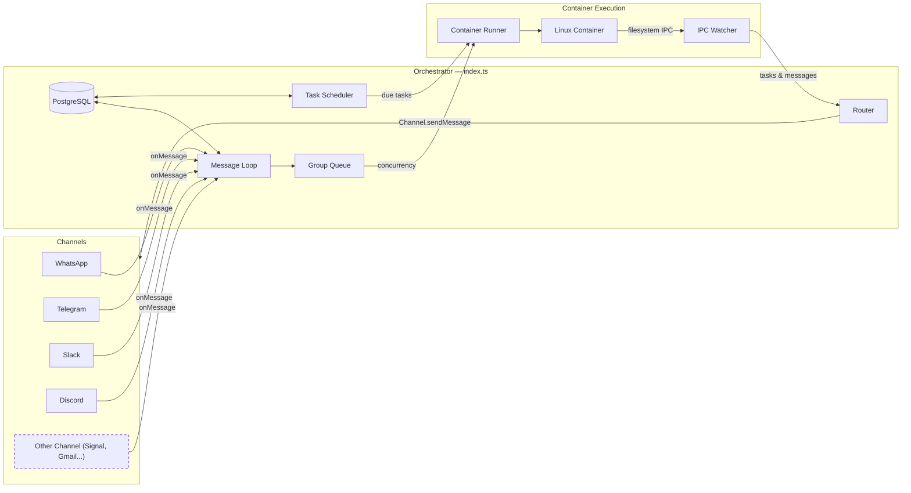

# NanoClaw Specification

A personal Claude assistant with multi-channel support, persistent memory per conversation, scheduled tasks, and container-isolated agent execution.

---

## Table of Contents

1. [Architecture](#architecture)
2. [Architecture: Channel System](#architecture-channel-system)
3. [Folder Structure](#folder-structure)
4. [Configuration](#configuration)
5. [Memory System](#memory-system)
6. [Session Management](#session-management)
7. [Message Flow](#message-flow)
8. [Commands](#commands)
9. [Scheduled Tasks](#scheduled-tasks)
10. [MCP Servers](#mcp-servers)
11. [Deployment](#deployment)
12. [Security Considerations](#security-considerations)

---

## Architecture

```
┌──────────────────────────────────────────────────────────────────────┐
│                        HOST (macOS / Linux)                           │
│                     (Main Node.js Process)                            │
├──────────────────────────────────────────────────────────────────────┤
│                                                                       │
│  ┌──────────────────┐                  ┌──────────────────────────┐  │
│  │ Channels         │─────────────────▶│   PostgreSQL               │  │
│  │ (self-register   │◀────────────────│   (nanoclaw-postgres-1)    │  │
│  │  at startup)     │  store/send      └─────────┬────────────────┘  │
│  └──────────────────┘                            │                   │
│                                                   │                   │
│         ┌─────────────────────────────────────────┘                   │
│         │                                                             │
│         ▼                                                             │
│  ┌──────────────────────┐  ┌──────────────────┐  ┌───────────────┐   │
│  │  Message Loop        │  │  Scheduler Loop  │  │  IPC Watcher  │   │
│  │  (polls PostgreSQL)  │  │  (checks tasks)  │  │  (file-based) │   │
│  └────────┬─────────────┘  └────────┬─────────┘  └───────────────┘   │
│           │                       │                                   │
│           └───────────┬───────────┘                                   │
│                       │ spawns container                              │
│                       ▼                                               │
├──────────────────────────────────────────────────────────────────────┤
│                     CONTAINER (Linux VM)                               │
├──────────────────────────────────────────────────────────────────────┤
│  ┌──────────────────────────────────────────────────────────────┐    │
│  │                    AGENT RUNNER                               │    │
│  │                                                                │    │
│  │  Working directory: /workspace/group (mounted from host)       │    │
│  │  Volume mounts:                                                │    │
│  │    • groups/{name}/ → /workspace/group                         │    │
│  │    • data/sessions/{group}/.claude/ → /home/node/.claude/      │    │
│  │    • Additional dirs → /workspace/extra/*                      │    │
│  │                                                                │    │
│  │  Tools (ceiling model — per-group denial via deniedTools):       │    │
│  │    • execute_command (MCP, approval-gated by default) or Bash  │    │
│  │      if approvalMode: false — controlled by containerConfig    │    │
│  │    • Read, Write, Edit, Glob, Grep (file operations)           │    │
│  │    • WebSearch/WebFetch excluded from defaults (use MCP)       │    │
│  │    • agent-browser (only if skill explicitly allowed)          │    │
│  │    • mcp__nanoclaw__* (IPC — always on; register_group hidden   │    │
│  │      from non-admin groups; delegate_to_group hidden from       │    │
│  │      non-main groups)                                           │    │
│  │    • Per-group MCP servers (e.g. brave-search, nanoclaw-web-search)  │    │
│  │                                                                │    │
│  └──────────────────────────────────────────────────────────────┘    │
│                                                                       │
└───────────────────────────────────────────────────────────────────────┘
```

### Technology Stack

| Component | Technology | Purpose |
|-----------|------------|---------|
| Channel System | Channel registry (`src/channels/registry.ts`) | Channels self-register at startup |
| Message Storage | PostgreSQL (postgres.js) | Store messages for polling |
| Container Runtime | Containers (Linux VMs) | Isolated environments for agent execution |
| Agent | @anthropic-ai/claude-agent-sdk (0.3.147) | Run Claude with tools and MCP servers |
| Browser Automation | agent-browser + Chromium | Web interaction and screenshots |
| Runtime | Node.js 20+ | Host process for routing and scheduling |

---

## Architecture: Channel System

The core ships with no channels built in — each channel (WhatsApp, Telegram, Slack, Discord, Gmail) is installed as a [Claude Code skill](https://code.claude.com/docs/en/skills) that adds the channel code to your fork. Channels self-register at startup; installed channels with missing credentials emit a WARN log and are skipped.

### System Diagram



### Channel Registry

The channel system is built on a factory registry in `src/channels/registry.ts`:

```typescript
export type ChannelFactory = (opts: ChannelOpts) => Channel | null;

const registry = new Map<string, ChannelFactory>();

export function registerChannel(name: string, factory: ChannelFactory): void {
  registry.set(name, factory);
}

export function getChannelFactory(name: string): ChannelFactory | undefined {
  return registry.get(name);
}

export function getRegisteredChannelNames(): string[] {
  return [...registry.keys()];
}
```

Each factory receives `ChannelOpts` (callbacks for `onMessage`, `onChatMetadata`, and `registeredGroups`) and returns either a `Channel` instance or `null` if that channel's credentials are not configured.

### Channel Interface

Every channel implements this interface (defined in `src/types.ts`):

```typescript
interface Channel {
  name: string;
  connect(): Promise<void>;
  sendMessage(jid: string, text: string): Promise<void>;
  isConnected(): boolean;
  ownsJid(jid: string): boolean;
  disconnect(): Promise<void>;
  setTyping?(jid: string, isTyping: boolean): Promise<void>;
  syncGroups?(force: boolean): Promise<void>;
  sendAttachment?(jid: string, filePath: string, caption?: string): Promise<void>;
  onGroupUpdated?(jid: string): Promise<void>;
}
```

**Optional hooks:**

| Method | Purpose |
|--------|---------|
| `setTyping` | Show/hide typing indicator on the platform |
| `syncGroups` | Sync group/chat names from the platform |
| `sendAttachment` | Send a file or image to the user |
| `onGroupUpdated` | Fired after a runtime mutation to a group's registration (e.g. `/model` or `/version` switch). Channels that surface group config on their platform (e.g. Telegram slash command menu) re-sync here. Dispatched only to the channel that `ownsJid(jid)`. Errors are swallowed (`logger.warn`) — the DB write is the source of truth. Channels with no platform-visible surface simply omit this method. |

**Runtime dispatch:** The `updateRegisteredGroup(jid, group)` helper in `src/index.ts` is the runtime entry point — it persists the group, then dispatches `onGroupUpdated` to the owning channel. Setup CLI, migrations, and tests use the raw `setRegisteredGroup` directly (channels are not connected at those points).

### Self-Registration Pattern

Channels self-register using a barrel-import pattern:

1. Each channel skill adds a file to `src/channels/` (e.g. `whatsapp.ts`, `telegram.ts`) that calls `registerChannel()` at module load time:

   ```typescript
   // src/channels/whatsapp.ts
   import { registerChannel, ChannelOpts } from './registry.js';

   export class WhatsAppChannel implements Channel { /* ... */ }

   registerChannel('whatsapp', (opts: ChannelOpts) => {
     // Return null if credentials are missing
     if (!existsSync(authPath)) return null;
     return new WhatsAppChannel(opts);
   });
   ```

2. The barrel file `src/channels/index.ts` imports all channel modules, triggering registration:

   ```typescript
   import './dashboard.js';
   import './telegram.js';
   // ... each skill adds its import here
   ```

3. At startup, the orchestrator (`src/index.ts`) loops through registered channels and connects whichever ones return a valid instance:

   ```typescript
   for (const name of getRegisteredChannelNames()) {
     const factory = getChannelFactory(name);
     const channel = factory?.(channelOpts);
     if (channel) {
       await channel.connect();
       channels.push(channel);
     }
   }
   ```

### Key Files

| File | Purpose |
|------|---------|
| `src/channels/registry.ts` | Channel factory registry |
| `src/channels/index.ts` | Barrel imports that trigger channel self-registration |
| `src/types.ts` | `Channel` interface, `ChannelOpts`, message types |
| `src/index.ts` | Orchestrator — instantiates channels, runs message loop |
| `src/router.ts` | Finds the owning channel for a JID, formats messages |

### Adding a New Channel

To add a new channel, contribute a skill to `.claude/skills/add-<name>/` that:

1. Adds a `src/channels/<name>.ts` file implementing the `Channel` interface
2. Calls `registerChannel(name, factory)` at module load
3. Returns `null` from the factory if credentials are missing
4. Adds an import line to `src/channels/index.ts`

See existing skills (`/add-whatsapp`, `/add-telegram`, `/add-slack`, `/add-discord`, `/add-gmail`) for the pattern.

---

## Folder Structure

```
nanoclaw/
├── CLAUDE.md                      # Project context for Claude Code
├── docs/
│   ├── spec.md                    # This specification document
│   ├── requirements.md            # Architecture decisions
│   └── security.md                # Security model
├── README.md                      # User documentation
├── package.json                   # Node.js dependencies
├── tsconfig.json                  # TypeScript configuration
├── .mcp.json                      # MCP server configuration (reference)
├── .gitignore
│
├── src/
│   ├── index.ts                   # Orchestrator: state, message loop, agent invocation
│   ├── channels/
│   │   ├── registry.ts            # Channel factory registry
│   │   ├── telegram.ts            # Telegram channel implementation
│   │   ├── dashboard.ts           # Dashboard channel implementation
│   │   └── index.ts               # Barrel imports for channel self-registration
│   ├── ipc.ts                     # IPC watcher and task processing
│   ├── router.ts                  # Message formatting and outbound routing
│   ├── config.ts                  # Configuration constants
│   ├── types.ts                   # TypeScript interfaces (includes Channel)
│   ├── logger.ts                  # Built-in logger with DB error wrapper
│   ├── db.ts                      # PostgreSQL connection pool and queries
│   ├── env.ts                     # Environment variable loading from secrets.env and .env
│   ├── group-queue.ts             # Per-group queue with global concurrency limit
│   ├── group-folder.ts            # Group folder path resolution and validation
│   ├── group-registry.ts          # Group registration helpers
│   ├── mount-security.ts          # Mount allowlist validation for containers
│   ├── host-commands.ts           # Host commands (/model, /version, /newsession, /shutdown, /stop, /context)
│   ├── task-scheduler.ts          # Runs scheduled tasks when due + nightly cron
│   ├── task-runtime-state.ts      # Runtime state derivation for scheduled tasks
│   ├── nightly-maintenance.ts     # Nightly cron: nudge, prune, expire, log rotation
│   ├── container-runner.ts        # Spawns agents in containers
│   ├── container-runtime.ts       # Volume mounts, image tag resolution
│   ├── credential-proxy.ts        # Host-side API proxy — injects real credentials
│   ├── multi-agent-router.ts      # Hub group routing (multiAgentRouter flag)
│   ├── remote-control.ts          # Remote control IPC
│   ├── session-sanitizer.ts       # Session JSONL sanitization (thinking blocks, tool IDs)
│   ├── sender-allowlist.ts        # Sender allowlist validation
│   ├── presets.ts                 # Model preset loading and resolution
│   ├── image.ts                   # Image encoding for vision
│   ├── transcription.ts           # Voice message transcription
│   ├── abandoned-run-sweep.ts     # Sweep for abandoned container runs
│   ├── cursor-state.ts            # Cursor state management
│   └── lib/                       # Security and utility modules
│       ├── ssrf-validator.ts      # SSRF URL validation (async, fail-closed)
│       ├── injection-scanner.ts   # Prompt injection pattern detection
│       ├── injection-scan-flow.ts # Injection scan orchestration
│       ├── context-scanner.ts     # Context file discovery and scanning
│       ├── command-approval.ts    # Dangerous command detection
│       ├── config-validator.ts    # containerConfig runtime validation
│       ├── nudge-prompt.ts        # Host-side nightly nudge prompt builder
│       ├── skill-manager.ts       # Extracted skill file reader
│       └── image-extraction.ts    # Image extraction from messages
│
├── container/
│   ├── Dockerfile                 # Container image (runs as 'node' user, includes Claude Code CLI)
│   ├── build.sh                   # Legacy build script (use container/scripts/container.sh instead)
│   ├── scripts/
│   │   └── container.sh           # Container image build/promote/list script (source of truth)
│   ├── VERSIONING.md              # Container versioning rules
│   ├── VERSIONS.json              # Channel→version mapping (managed by container.sh)
│   ├── agent-runner/              # Code that runs inside the container
│   │   ├── package.json
│   │   ├── tsconfig.json
│   │   └── src/
│   │       ├── index.ts           # Entry point (query loop, IPC polling, session resume)
│   │       ├── ipc-mcp-stdio.ts   # Stdio-based MCP server for host communication
│   │       └── lib/               # Container-side utility modules
│   │           ├── command-approval.ts    # Command detection
│   │           ├── degenerate-detector.ts # Degenerate token detection (entropy + n-gram)
│   │           ├── nudge-prompt.ts        # Container-side nudge prompt builder (periodic + threshold)
│   │           └── post-turn-checks.ts    # Post-turn health checks (silent turn + degenerate)
│   ├── binaries/                  # Host-stored binaries (NOT in Docker image)
│   │   └── agent-browser/         # MUST be committed to git — runtime source for browser skill
│   ├── mcp-servers/               # Self-built MCP servers (built into Docker image)
│   │   ├── brave-search/          # Brave Search API wrapper
│   │   ├── nanoclaw-web-search/   # Web search via credential proxy (any vendor)
│   │   └── nanoclaw-transcription/ # Voice transcription MCP server
│   └── skills/
│       ├── agent-browser/         # Browser automation skill
│       ├── capabilities/          # Runtime capability introspection
│       ├── glm-ocr/              # OCR skill
│       ├── learning-loop/         # Skill extraction format guide (when learningLoop enabled)
│       ├── slack-formatting/      # Slack markdown formatting
│       ├── status/                # Status reporting skill
│       ├── telegram-formatting/   # Telegram Markdown v1 formatting
│       └── uplynk-api/           # Uplynk API skill
│
├── dist/                          # Compiled JavaScript (gitignored)
│
├── .claude/
│   └── skills/                         # Claude Code skills (invoked via /command)
│       ├── setup/                      # /setup - First-time installation
│       ├── debug/                      # /debug - Container debugging
│       ├── claw/                       # /claw - CLI utility
│       ├── configure-group/            # /configure-group - Group configuration
│       ├── customize-claude-md/        # /customize-claude-md - CLAUDE.md builder
│       ├── update-nanoclaw/            # /update-nanoclaw - Upstream updates
│       ├── update-skills/              # /update-skills - Skill updates
│       ├── add-telegram/               # /add-telegram - Telegram channel
│       ├── add-telegram-swarm/         # /add-telegram-swarm - Multi-bot Telegram
│       ├── add-whatsapp/               # /add-whatsapp - WhatsApp channel
│       ├── add-slack/                  # /add-slack - Slack channel
│       ├── add-discord/                # /add-discord - Discord channel
│       ├── add-gmail/                  # /add-gmail - Gmail integration
│       ├── add-internal-group/         # /add-internal-group - Internal groups
│       ├── add-image-vision/           # /add-image-vision - Image vision
│       ├── add-voice-transcription/    # /add-voice-transcription - Whisper
│       ├── add-transcription/          # /add-transcription - Transcription
│       ├── add-reactions/              # /add-reactions - Message reactions
│       ├── add-parallel/               # /add-parallel - Parallel agents
│       ├── add-compact/                # /add-compact - Compaction
│       ├── add-ollama-tool/            # /add-ollama-tool - Ollama tools
│       ├── add-pdf-reader/             # /add-pdf-reader - PDF reading
│       ├── convert-to-apple-container/ # /convert-to-apple-container - Apple Container runtime
│       ├── use-local-whisper/          # /use-local-whisper - Local Whisper
│       ├── use-native-credential-proxy/ # /use-native-credential-proxy - Native proxy
│       ├── x-integration/             # /x-integration - X/Twitter
│       ├── glm-ocr/                   # /glm-ocr - OCR skill
│       ├── get-qodo-rules/            # /get-qodo-rules - Qodo coding rules
│       └── qodo-pr-resolver/          # /qodo-pr-resolver - Qodo PR review
│
├── groups/
│   ├── CLAUDE.md                  # Bootstrap template (copied at group creation, not loaded at runtime)
│   ├── {channel}_main/             # Main control channel (e.g., whatsapp_main/)
│   │   ├── CLAUDE.md              # Main channel memory
│   │   └── logs/                  # Task execution logs
│   └── {channel}_{group-name}/    # Per-group folders (created on registration)
│       ├── CLAUDE.md              # Group-specific memory
│       ├── logs/                  # Task logs for this group
│       └── *.md                   # Files created by the agent
│
├── store/                         # Local data (gitignored)
│   └── messages.db                # Legacy artifact — was SQLite database prior to PostgreSQL migration. Primary store is now PostgreSQL (Docker volume pgdata, container nanoclaw-postgres-1)
│
├── data/                          # Application state (gitignored)
│   ├── sessions/                  # Per-group session data (.claude/ dirs with JSONL transcripts)
│   └── ipc/                       # Container IPC (messages/, tasks/)
│
├── logs/                          # Runtime logs (gitignored)
│   ├── nanoclaw.log               # Host stdout
│   └── nanoclaw.error.log         # Host stderr
│   # Note: Per-container logs are in groups/{folder}/logs/container-*.log
│
└── launchd/
    └── com.nanoclaw.plist         # macOS service configuration
```

---

## Configuration

Configuration constants are in `src/config.ts`:

```typescript
import path from 'path';

export const ASSISTANT_NAME = process.env.ASSISTANT_NAME || envConfig.ASSISTANT_NAME || 'Bot';
export const POLL_INTERVAL = 2000;
export const SCHEDULER_POLL_INTERVAL = 60000;

// Paths are absolute (required for container mounts)
const PROJECT_ROOT = process.cwd();
export const STORE_DIR = path.resolve(PROJECT_ROOT, 'store');
export const GROUPS_DIR = path.resolve(PROJECT_ROOT, 'groups');
export const DATA_DIR = path.resolve(PROJECT_ROOT, 'data');

// Container configuration (channel-based resolution)
export const CONTAINER_IMAGE_OVERRIDE = process.env.CONTAINER_IMAGE || envConfig.CONTAINER_IMAGE || '';
export const CONTAINER_IMAGE_BASE = 'nanoclaw-agent';
// resolveImageTag(channel?) → uses CONTAINER_IMAGE_OVERRIDE if set, else `${CONTAINER_IMAGE_BASE}:${channel || 'stable'}`
export const CONTAINER_TIMEOUT = parseInt(process.env.CONTAINER_TIMEOUT || envConfig.CONTAINER_TIMEOUT || '1800000', 10); // 30min default
export const IPC_POLL_INTERVAL = 1000;
export const IDLE_TIMEOUT = parseInt(process.env.IDLE_TIMEOUT || envConfig.IDLE_TIMEOUT || '1800000', 10); // 30min — keep container alive after last result
export const MAX_CONCURRENT_CONTAINERS = Math.max(1, parseInt(process.env.MAX_CONCURRENT_CONTAINERS || envConfig.MAX_CONCURRENT_CONTAINERS || '5', 10) || 5);
export const NUDGE_INTERVAL = Math.max(0, parseInt(process.env.NUDGE_INTERVAL || envConfig.NUDGE_INTERVAL || '10', 10) || 10);
export const NIGHTLY_NUDGE_THRESHOLD = 0.7; // Configurable via env
export const DEFAULT_CONTEXT_WINDOW = 128000; // Configurable via env

export const TRIGGER_PATTERN = new RegExp(`^@${ASSISTANT_NAME}\\b`, 'i');
```

**Note:** Paths must be absolute for container volume mounts to work correctly.

### Container Configuration

Per-group behaviour is controlled via `containerConfig` — stored as `jsonb` in the `registered_groups.container_config` PostgreSQL column. All fields are optional; omitting a field preserves backward-compatible defaults.

```json
{
  "preset": "sonnet_4.5",
  "skills": ["status", "browser"],
  "allowedTools": ["Read", "Grep", "WebSearch"],
  "mcpServers": {
    "brave-search": {
      "command": "node",
      "args": ["/app/mcp-servers/brave-search/dist/index.js"]
    }
  },
  "systemPrompt": "You are a financial analyst. Be concise and data-driven.",
  "timeout": 3600000,
  "additionalMounts": [
    { "hostPath": "~/Documents/finance", "containerPath": "finance", "readonly": true }
  ]
}
```

#### Field Reference

| Field | Type | Default | Purpose |
|-------|------|---------|---------|
| `preset` | `string` | **required** | Named model preset from `~/.config/nanoclaw/model-presets.json`. Resolves endpoint, model, capabilities, contextWindow, compactThreshold, webSearchVendor at runtime. |
| `taskPreset` | `string` | `undefined` (uses base preset) | Preset override for scheduled task runs |
| `nudgePreset` | `string` | `undefined` (uses base preset) | Preset override for nightly nudge runs |
| `skills` | `string[]` | `undefined` = none | Per-group skill selection. `[]` = none, `["x","y"]` = named only |
| `systemPrompt` | `string` | `undefined` | Appended after `claude_code` preset prompt (agent persona/instructions) |
| `mcpServers` | `object` | `undefined` = nanoclaw only | Per-group MCP servers alongside built-in nanoclaw IPC. Key = server name, value = `{ command, args?, env? }` |
| `timeout` | `number` | `300000` (5 min) | Container timeout override in ms |
| `additionalMounts` | `AdditionalMount[]` | `[]` | Extra host directories (validated against mount-allowlist.json) |
| `telegramBot` | `string` | `undefined` (default bot) | Telegram bot instance name. Maps to `TELEGRAM_{NAME}_BOT_TOKEN` in secrets.env |
| `injectionScanMode` | `'off' \| 'warn' \| 'block'` | `'warn'` | Prompt injection scanning for context files (CLAUDE.md, MEMORY.md, daily notes) before launch |
| `ssrfProtection` | `boolean \| SsrfConfig` | `true` (enabled) | SSRF protection for outbound web_fetch. `false` = disabled, `true` = default, object = custom host lists |
| `approvalMode` | `boolean` | `true` | Command approval for dangerous commands on write-mounted paths. Replaces Bash with `mcp__nanoclaw__execute_command` |
| `approvalTimeout` | `number` | `120` (2 min) | Seconds before an unanswered approval request auto-denies. Range: 10–600 |
| `commandAllowlist` | `string[]` | `[]` | Regex patterns for pre-approved commands that skip approval flow |
| `allowedHostCommands` | `string[]` | `undefined` = none | Per-group host command allowlist. `['model']` enables `/model` to switch presets |
| `learningLoop` | `boolean \| 'extract-only'` | `false` | Skill extraction during memory nudge. `true` = extract + load, `'extract-only'` = extract for review |
| `deniedTools` | `string[]` | `[]` | Per-group denied tools — subtracted from the system allowlist ceiling (tool-allowlist.json) |
| `hooks` | `string[]` | `undefined` | Ordered reminder keys (filenames in `docs/hooks/`) injected via UserPromptSubmit hook on live chat turns |

#### `skills` — Per-Group Skill Selection

| Value | Behaviour |
|-------|-----------|
| `undefined` / absent | No skills — secure default |
| `[]` | No skills — minimal container |
| `["status", "browser"]` | Only named skills |

**`agent-browser` is special**: it is NOT installed in the Docker image. The binary is stored on the host at `container/binaries/agent-browser/` and mounted into the container only when `agent-browser` is explicitly in the group's `skills` list. Without the mount, the binary does not exist in the container — agents cannot browse the web via Bash even if they try.

> **Important**: `container/binaries/agent-browser/` MUST be committed to git. It is the only source of the binary at runtime. Do NOT add it to `.gitignore`.

#### Tool Governance — Allowlist Ceiling Model

Tools are governed by a **ceiling model**: `tool-allowlist.json` (project root) defines the maximum set of tools any group can ever resolve. Per-group `deniedTools` subtracts from the ceiling. Hard security rules (approval mode, native web tools) further restrict unconditionally.

**Resolution formula (agent-runner, container-side):**

```
resolved = ceiling − deniedTools − Bash (if approvalMode) − WebSearch/WebFetch (if !nativeWebTools)
allowedTools = [...resolved, 'mcp__nanoclaw__*']
```

The host passes `NANOCLAW_TOOL_CEILING` and `NANOCLAW_DENIED_TOOLS` as env vars to the container. The agent-runner performs the resolution at startup.

**`deniedTools` — Per-Group Denial:**

| Value | Behaviour |
|-------|-----------|
| `undefined` / absent / `[]` | No per-group denial — full ceiling available (minus conditional removals) |
| `["Task", "Bash"]` | Named tools removed from resolved set for this group |

`mcp__nanoclaw__*` is always injected regardless of config (IPC cannot be denied).

**How the complement works internally:**

The SDK's `allowedTools` parameter only filters SDK-registered tools. The `claude_code` preset injects additional CLI tools (`Agent`, `CronCreate`, `EnterPlanMode`, etc.) that bypass `allowedTools` entirely. To block these, the agent-runner computes `disallowedTools` as the complement of the resolved set against `ALL_KNOWN_TOOLS`:

```
disallowedTools = ALL_KNOWN_TOOLS − resolved
```

`disallowedTools` reliably blocks any tool, including preset-injected ones. This is computed automatically — never configured directly.

**Ceiling reference** — the tool catalog (`tool-allowlist.json`):

| Category | Tools |
|----------|-------|
| File Operations | `Read`, `Write`, `Edit`, `Glob`, `Grep` |
| Execution | `Bash`, `NotebookEdit` |
| Web | `WebSearch` |
| Planning | `EnterPlanMode`, `ExitPlanMode` |
| Tasks | `TaskCreate`, `TaskGet`, `TaskList`, `TaskUpdate`, `TaskStop`, `TaskOutput` |
| Scheduling | `CronCreate`, `CronDelete`, `CronList` |
| Git/Worktree | `EnterWorktree`, `ExitWorktree` |
| Agent Teams | `TeamCreate`, `TeamDelete`, `SendMessage` |
| Subagent & Skills | `Task`¹, `Skill` |
| User Interaction | `AskUserQuestion` |
| Monitoring | `Monitor`, `PushNotification`, `ScheduleWakeup`, `ToolSearch` |
| Always available | `mcp__nanoclaw__*` (IPC — not in ceiling, always injected) |

¹ **Task/Agent naming split**: The subagent tool resolves as `Task` in `options.tools` and `tool-allowlist.json`, but appears as `Agent` in `tool_use` invocation blocks. Denying `Task` removes subagent capability entirely.

**Permanently denied (not in ceiling):** `RemoteTrigger`, `TodoWrite`, `WebFetch` — blocked for all groups regardless of config.

> **SDK upgrade note**: When upgrading `@anthropic-ai/claude-agent-sdk`, run the probe procedure in `docs/sdk-tool-catalog-rediscovery.md` to detect new/removed tools. Update `tool-allowlist.json` and `VERIFIED_CATALOG`/`FALLBACK_CATALOG` in code. New tools are denied-by-default until explicitly admitted.

#### `preset` — Per-Group Model Preset

Groups select their model via a named preset from `~/.config/nanoclaw/model-presets.json`. The preset resolves `endpoint`, `model`, `capabilities`, `contextWindow`, and `webSearchVendor` at runtime via `resolvePreset()`.

**Preset file schema** (`~/.config/nanoclaw/model-presets.json`):

```json
{
  "sonnet_4.5": {
    "endpoint": "anthropic",
    "model": "claude-sonnet-4-5-20250514",
    "capabilities": { "vision": true, "tools": true },
    "contextWindow": 200000,
    "webSearchVendor": "ollama"
  },
  "ollama_k2.6": {
    "endpoint": "ollama",
    "model": "kimi-k2.6:cloud",
    "capabilities": { "vision": false, "tools": true },
    "contextWindow": 262144,
    "compactThreshold": 0.57
  }
}
```

| Preset Field | Type | Required | Default |
|--------------|------|----------|---------|
| `endpoint` | `string` | yes | — |
| `model` | `string` | yes | — |
| `capabilities` | `{ vision: boolean, thinking?: boolean, tools?: boolean }` | yes | — |
| `contextWindow` | `number` | no | `128000` |
| `compactThreshold` | `number` (0.1–0.95) | no | `0.8` |
| `webSearchVendor` | `string` | no | `"ollama"` |

**Auto-compaction**: At container spawn, `settings.json` is written with `autoCompactEnabled: true` and `autoCompactWindow = contextWindow * compactThreshold`. This tells the SDK to compact the conversation when input tokens exceed the threshold. Without this, non-Anthropic models (via Ollama) may never trigger compaction because the SDK cannot detect their context window from API responses.

**Runtime resolution**: `containerConfig.preset` → `resolvePreset(name)` → returns the full `ResolvedPreset` with endpoint, model, capabilities, contextWindow, compactThreshold, webSearchVendor. All container spawn, IPC, and scheduling paths use this.

Use the `/model` host command (requires `allowedHostCommands: ['model']`) to switch presets. This stores only the preset name in the database and recycles the active container so the next message spawns fresh with the new config.

#### `systemPrompt` — Per-Group Persona

| Value | Behaviour |
|-------|-----------|
| `undefined` / absent | No additional system prompt |
| `"You are X..."` | Appended after `claude_code` preset prompt |

#### `additionalMounts` — Extra Host Directories

Additional mounts appear at `/workspace/extra/{containerPath}` inside the container. Paths are validated against `~/.config/nanoclaw/mount-allowlist.json` before mounting.

```typescript
// Example registration
setRegisteredGroup("1234567890@g.us", {
  name: "Dev Team",
  folder: "whatsapp_dev-team",
  trigger: "@Andy",
  added_at: new Date().toISOString(),
  containerConfig: {
    additionalMounts: [
      { hostPath: "~/projects/webapp", containerPath: "webapp", readonly: false }
    ],
    timeout: 600000,
  },
});
```

Folder names follow the convention `{channel}_{group-name}` (e.g., `whatsapp_family-chat`, `telegram_dev-team`). The main group has `isMain: true` set during registration.

**Mount syntax note:** Read-write mounts use `-v host:container`, but readonly mounts require `--mount "type=bind,source=...,target=...,readonly"` (the `:ro` suffix may not work on all runtimes).

#### `mcpServers` — Per-Group MCP Servers

Add additional MCP servers to a group's container alongside the always-present `nanoclaw` IPC server.

```json
{
  "mcpServers": {
    "brave-search": {
      "command": "node",
      "args": ["/app/mcp-servers/brave-search/dist/index.js"]
    }
  }
}
```

| Value | Behaviour |
|-------|-----------|
| `undefined` / absent | Only `nanoclaw` IPC server |
| `{ "brave-search": { ... } }` | Adds Brave Search alongside nanoclaw |

The `nanoclaw` server is always present and cannot be overridden — if a group config includes a key named `nanoclaw`, it is silently ignored.

**Brave Search MCP**: A self-built MCP server at `container/mcp-servers/brave-search/` that wraps the Brave Search API. The API key (`BRAVE_SEARCH_API_KEY`) is read from `~/.config/nanoclaw/secrets.env` on the host and injected as a container env var — the container never sees the host secrets file.

**NanoClaw Web Search MCP**: A self-built MCP server at `container/mcp-servers/nanoclaw-web-search/` that exposes `web_search` and `web_fetch` tools. Unlike brave-search (which injects an API key directly), web search routes through the credential proxy — the MCP server only needs the proxy host/port and vendor name. The proxy injects real API keys at request time. Configured via the resolved preset's `webSearchVendor` field (defaults to `"ollama"`). Requires `{VENDOR}_WEB_SEARCH_BASE_URL` + `{VENDOR}_WEB_SEARCH_API_KEY` in `secrets.env`. See [OLLAMA_WEB_SEARCH_INTEGRATION.md](OLLAMA_WEB_SEARCH_INTEGRATION.md) for the full design.

#### `allowedHostCommands` — Host Commands

Host commands are intercepted on the host process before reaching the agent container. They work across all channels and are gated per-group via an explicit allowlist.

| Value | Behaviour |
|-------|-----------|
| `undefined` / absent | No host commands allowed (secure default) |
| `['model']` | Enables `/model` to switch model presets |

**`/model`** — Switch between model presets defined in `~/.config/nanoclaw/model-presets.json`:

```json
{
  "ollama_k2.6": {
    "endpoint": "ollama",
    "model": "kimi-k2.6:cloud",
    "capabilities": { "vision": false, "tools": true },
    "contextWindow": 262144,
    "compactThreshold": 0.57
  },
  "opus_4.7": {
    "endpoint": "anthropic",
    "model": "claude-opus-4-7",
    "capabilities": { "vision": true, "tools": true },
    "contextWindow": 200000
  }
}
```

Send `/model` to list the active preset and available choices. Send `/model <preset>` to switch. The active container is recycled on switch so the next message spawns a fresh container with the new config. Only the `preset` name is stored in `containerConfig` — all other fields are preserved.

When switching models, NanoClaw automatically sanitizes the session `.jsonl` transcript: non-compliant `tool_use` IDs (e.g. from Ollama) are rewritten to match `^[a-zA-Z0-9-]+$`, and `thinking` blocks (which carry model-specific cryptographic signatures) are stripped so the new model can safely resume the session.

### Claude Authentication

Containers never see real API keys or tokens. The credential proxy (`src/credential-proxy.ts`) runs on the host and intercepts all API traffic:

1. Container sends requests to `http://host.docker.internal:3001` with a placeholder key
2. Proxy swaps in real credentials from `~/.config/nanoclaw/secrets.env` (or `.env` fallback)
3. Proxy forwards to the upstream API (Anthropic, Ollama, Z.ai, etc.)

The proxy listens on `127.0.0.1:3001` (configurable via `CREDENTIAL_PROXY_PORT`). The `.env` file in the project root is shadowed by `/dev/null` in main group containers to prevent agents from reading it.

**Two auth modes:**

**Option 1: Claude Subscription (OAuth token)**
```bash
# ~/.config/nanoclaw/secrets.env
CLAUDE_CODE_OAUTH_TOKEN=sk-ant-oat01-...
```
The token can be extracted from `~/.claude/.credentials.json` if you're logged in to Claude Code.

**Option 2: Pay-per-use API Key**
```bash
# ~/.config/nanoclaw/secrets.env
ANTHROPIC_API_KEY=sk-ant-api03-...
```

Only the authentication variables (`CLAUDE_CODE_OAUTH_TOKEN` and `ANTHROPIC_API_KEY`) are used by the credential proxy to inject real credentials at request time. Containers receive placeholder values only — real secrets never enter the container environment or filesystem.

### Changing the Assistant Name

Set the `ASSISTANT_NAME` environment variable:

```bash
ASSISTANT_NAME=Bot npm start
```

Or edit the default in `src/config.ts`. This changes:
- The trigger pattern (messages must start with `@YourName`)
- The response prefix (`YourName:` added automatically)

### Placeholder Values in launchd

Files with `{{PLACEHOLDER}}` values need to be configured:
- `{{PROJECT_ROOT}}` - Absolute path to your nanoclaw installation
- `{{NODE_PATH}}` - Path to node binary (detected via `which node`)
- `{{HOME}}` - User's home directory

---

## Memory System

NanoClaw uses a per-group memory system with CLAUDE.md files and `@import` directives for persistent memory.

### Memory and Context

Each group has a `CLAUDE.md` file at `groups/<group>/CLAUDE.md`. The Claude Agent SDK auto-loads this from the working directory (`/workspace/group`) at session start.

CLAUDE.md templates include an `@import` directive for `@memory/MEMORY.md`, which the SDK expands at container spawn time.

### Memory Protocol

Agents manage two memory files inside `groups/{folder}/memory/`:

| File | Behaviour | Purpose |
|------|-----------|---------|
| `MEMORY.md` | Read, append, remove superseded entries. No duplicates. | Durable facts — user preferences, corrections, long-term knowledge |
| `YYYY-MM-DD.md` | Append daily. | Session-specific observations and daily notes |

The `memory/` directory is created automatically during group registration, along with a seed `MEMORY.md` if one doesn't exist.

### How Memory Works

1. **Agent Context Loading**
   - Agent runs with `cwd` set to `/workspace/group` (mounted from `groups/{group-name}/`)
   - Claude Agent SDK with `settingSources: ['project', 'user']` loads CLAUDE.md from `cwd`
   - `@import` directive in CLAUDE.md expands `MEMORY.md` at spawn time

2. **Writing Memory**
   - "Remember this: ..." → agent may write to `MEMORY.md` or `CLAUDE.md`
   - Agent can create files like `notes.md`, `research.md` in the group folder
   - You can edit CLAUDE.md directly — it's plain markdown

3. **Main Channel Privileges**
   - Only the "main" group (self-chat) has `is_main` flag
   - Main can manage registered groups and schedule tasks for any group
   - Main can configure additional directory mounts for any group
   - All groups have Bash access (safe because it runs inside container)

---

### Image Vision

When a group's resolved preset has `capabilities.vision: true`, agents can receive and understand image attachments sent by users.

**Image extraction**: The message loop matches `[Photo]: /path caption` patterns in incoming messages. Images are processed only when the resolved preset supports vision.

**Pipeline** (`src/image.ts`):
1. Validate file exists and is a supported format (`.jpg`, `.jpeg`, `.png`, `.webp`, `.gif`)
2. Resize to fit within 1568×1568px (Claude's recommended max), maintaining aspect ratio
3. Normalize to JPEG at 85% quality
4. Base64 encode

**Limits**: 10MB total payload limit per message batch (images are truncated if exceeded).

**IPC piping**: When images are piped to an active container via IPC, the JSON message includes an `images` array. The agent-runner uses `pushMultimodal()` to build content blocks with both image and text.

**Outbound attachments**: Agents can send files back to users via the `send_attachment` MCP tool. The tool validates the file exists within `/workspace/group/`, writes an IPC message with `type: 'attachment'`, and the host resolves the container path to the host path before routing to the channel's `sendAttachment()` method.

---

## Session Management

Sessions enable conversation continuity — Claude remembers what you talked about across container restarts. Agents are NOT stateless between messages.

### How Sessions Work

1. First message to a group → no session ID → Claude Agent SDK starts a fresh session, returns `newSessionId`
2. NanoClaw stores the ID in PostgreSQL (`sessions` table, keyed by `group_folder`) via `setSession()`
3. Next message → stored `sessionId` passed to SDK `resume` option → resumes from `.jsonl` transcript
4. This continues indefinitely — every message resumes the same session with full conversation history

### Container Lifecycle

Containers are NOT one-per-message:

1. Message arrives → container spawns (or message is piped to existing container via IPC polling)
2. Container stays alive, waiting for follow-up messages via IPC
3. After 30 minutes of no output (idle timeout), NanoClaw stops the container
4. Next message → new container spawns, but resumes the same session via `sessionId`

The `--rm` flag on `docker run` ensures containers are cleaned up after exit.

### Three Layers of Memory

| Layer | Mechanism | Survives Session Reset? | Primary Use |
|-------|-----------|------------------------|-------------|
| Session transcript (`.jsonl`) | SDK session resumption | No — tied to session ID | Full conversation continuity |
| `MEMORY.md` | `@import` in CLAUDE.md → SDK loads at spawn | Yes — persists across sessions | Durable facts, user preferences |
| CLAUDE.md (group folder) | SDK loads from `cwd` on startup | Yes — it's a file you control | Instructions, personality, skills |

The session transcript is the primary memory mechanism — the agent gets full conversation replay on every message. `MEMORY.md` is loaded via an `@import` directive in CLAUDE.md, so it's always available even after a session reset. CLAUDE.md is for explicit instructions you want the agent to always follow.

Memory persistence is continuous: the agent writes durable facts to `MEMORY.md` throughout its session via periodic nudge prompts. Sessions are long-running and are never automatically deleted.

### Where Session Data Lives

| What | Host Path | Purpose |
|------|-----------|---------|
| Session transcript | `data/sessions/<folder>/.claude/projects/-workspace-group/<uuid>.jsonl` | Full conversation history (Claude Code internal format) |
| Auto-memory | `data/sessions/<folder>/.claude/projects/-workspace-group/memory/*.md` | Persistent notes Claude writes itself (survives session reset) |
| Session ID mapping | PostgreSQL → `sessions` table | Maps group folder → current session UUID |
| Settings | `data/sessions/<folder>/.claude/settings.json` | Claude Code env vars (model, features) |
| Skills | `data/sessions/<folder>/.claude/skills/` | Copied from `container/skills/` per-group |

### Context Loading Order

When a container starts, context is loaded in this order:

1. Claude Code built-in system prompt (`claude_code` preset)
2. `containerConfig.systemPrompt` (appended to preset prompt)
3. `CLAUDE.md` in the group folder (auto-loaded by SDK from `cwd`) — includes `@import` of `MEMORY.md`
4. Session transcript (if resuming an existing session)

---

## Message Flow

### Incoming Message Flow

```
1. User sends a message via any connected channel
   │
   ▼
2. Channel receives message (e.g. Baileys for WhatsApp, Bot API for Telegram)
   │
   ▼
3. Message stored in PostgreSQL
   │
   ▼
4. Message loop polls PostgreSQL (every 2 seconds)
   │
   ▼
5. Router checks:
   ├── Is chat_jid in registered groups (PostgreSQL)? → No: ignore
   └── Does message match trigger pattern? → No: store but don't process
   │
   ▼
6. Router catches up conversation:
   ├── Fetch all messages since last agent interaction
   ├── Format with timestamp and sender name
   └── Build prompt with full conversation context
   │
   ▼
7. Router invokes Claude Agent SDK:
   ├── cwd: groups/{group-name}/
   ├── prompt: conversation history + current message
   ├── resume: session_id (for continuity)
   └── mcpServers: nanoclaw (scheduler)
   │
   ▼
8. Claude processes message:
   ├── Reads CLAUDE.md files for context
   └── Uses tools as needed (search, email, etc.)
   │
   ▼
9. Router prefixes response with assistant name and sends via the owning channel
   │
   ▼
10. Router updates last agent timestamp and saves session ID
```

### Outbound Response Delivery

Understanding how agent output reaches the user is critical when writing CLAUDE.md instructions or debugging duplicate messages.

**Two independent delivery paths exist:**

| Path | Source | When it fires |
|------|--------|---------------|
| Text output | `result.result` from the container | When the agent finishes (per streaming result) |
| `send_message` MCP tool | `mcp__nanoclaw__send_message` | Immediately, mid-run, when the agent calls it |

Both paths call `channel.sendMessage()` independently. If an agent calls `send_message` AND produces text output, the user receives two separate messages. This is the most common source of duplicate messages.

**Correct use of `send_message`:**
- Mid-run acknowledgement before a long task ("On it, give me a moment")
- Delegating to another group via `target_jid`

For normal replies, the agent should respond with text output only. This must be stated explicitly in each group's `CLAUDE.md` — agents default to using `send_message` for everything if not instructed otherwise.

**Suppressing unwanted output:** `formatOutbound()` in `src/router.ts` strips `<internal>...</internal>` blocks before sending text output to the channel. Agents can wrap post-tool commentary in `<internal>` tags to prevent it reaching the user:

```
<internal>Message sent, waiting for next input.</internal>
```

**Channel-specific formatting:** Each channel requires different markdown syntax. Always include the relevant formatting skill in `containerConfig.skills` — do not duplicate rules in CLAUDE.md:

| Channel | Skill | Key rule |
|---------|-------|----------|
| Telegram | `telegram-formatting` | Markdown v1 — `*bold*`, no `**double**`, no `# headings` |
| Slack | `slack-formatting` | mrkdwn — `*bold*`, `<url\|text>` links |
| Discord | (none needed) | Standard markdown works |ggers (case insensitive)
- `Hey @Andy` → ❌ Ignored (trigger not at start)
- `What's up?` → ❌ Ignored (no trigger)

### Conversation Catch-Up

When a triggered message arrives, the agent receives all messages since its last interaction in that chat. Each message is formatted with timestamp and sender name:

```
[Jan 31 2:32 PM] John: hey everyone, should we do pizza tonight?
[Jan 31 2:33 PM] Sarah: sounds good to me
[Jan 31 2:35 PM] John: @Andy what toppings do you recommend?
```

This allows the agent to understand the conversation context even if it wasn't mentioned in every message.

### Per-Turn Prompt Reminders (Hooks)

On the live-chat spawn path only, the host resolves file-driven reminder snippets from `docs/hooks/` via `src/prompt-reminders.ts`. The resolved string is passed as `ContainerInput.promptReminder`. Inside the container, the agent-runner registers a `UserPromptSubmit` hook that injects the reminder as `additionalContext` on every user turn. This reinforces critical per-group rules (formatting, ack-before-work) without relying on CLAUDE.md context surviving auto-compaction.

Nudge and scheduled-task spawn paths do not pass `promptReminder` — the reminder only fires during interactive chat.

---

## Commands

### Commands Available in Any Group

| Command | Example | Effect |
|---------|---------|--------|
| `@Assistant [message]` | `@Andy what's the weather?` | Talk to Claude |

### Commands Available in Main Channel Only

| Command | Example | Effect |
|---------|---------|--------|
| `@Assistant add group "Name"` | `@Andy add group "Family Chat"` | Register a new group |
| `@Assistant remove group "Name"` | `@Andy remove group "Work Team"` | Unregister a group |
| `@Assistant list groups` | `@Andy list groups` | Show registered groups |
| `@Assistant remember [fact]` | `@Andy remember I prefer dark mode` | Add to global memory |

---

## Scheduled Tasks

NanoClaw has a built-in scheduler that runs tasks as full agents in their group's context.

### How Scheduling Works

1. **Group Context**: Tasks created in a group run with that group's working directory and memory
2. **Full Agent Capabilities**: Scheduled tasks have access to all tools (WebSearch, file operations, etc.)
3. **Optional Messaging**: Tasks can send messages to their group using the `send_message` tool, or complete silently
4. **Main Channel Privileges**: The main channel can schedule tasks for any group and view all tasks

### Schedule Types

| Type | Value Format | Example |
|------|--------------|---------|
| `cron` | Cron expression | `0 9 * * 1` (Mondays at 9am) |
| `interval` | Milliseconds | `3600000` (every hour) |
| `once` | ISO timestamp (local, no `Z`) | `2024-12-25T09:00:00` |

### Creating a Task

```
User: @Andy remind me every Monday at 9am to review the weekly metrics

Claude: [calls mcp__nanoclaw__schedule_task]
        {
          "prompt": "Send a reminder to review weekly metrics. Be encouraging!",
          "schedule_type": "cron",
          "schedule_value": "0 9 * * 1"
        }

Claude: Done! I'll remind you every Monday at 9am.
```

### One-Time Tasks

```
User: @Andy at 5pm today, send me a summary of today's emails

Claude: [calls mcp__nanoclaw__schedule_task]
        {
          "prompt": "Search for today's emails, summarize the important ones, and send the summary to the group.",
          "schedule_type": "once",
          "schedule_value": "2024-01-31T17:00:00"
        }
```

### Managing Tasks

From any group:
- `@Andy list my scheduled tasks` - View tasks for this group
- `@Andy pause task [id]` - Pause a task
- `@Andy resume task [id]` - Resume a paused task
- `@Andy cancel task [id]` - Delete a task

From main channel:
- `@Andy list all tasks` - View tasks from all groups
- `@Andy schedule task for "Family Chat": [prompt]` - Schedule for another group

---

## MCP Servers

### NanoClaw MCP (built-in)

The `nanoclaw` MCP server is created dynamically per agent call with the current group's context.

**Available Tools:**
| Tool | Purpose |
|------|---------|
| `schedule_task` | Schedule a recurring or one-time task |
| `list_tasks` | Show tasks (group's tasks, or all if main) |
| `get_task` | Get task details and run history |
| `search_tasks` | Search tasks by keyword |
| `update_task` | Modify task prompt or schedule |
| `pause_task` | Pause a task |
| `resume_task` | Resume a paused task |
| `cancel_task` | Delete a task |
| `send_message` | Send a message to the group via its channel |
| `send_attachment` | Send a file (image, video, document) from the container to the user via the channel |
| `delegate_to_group` | Send a task to a target group (main only), get a UUID for correlation |
| `respond_to_group` | Respond to a pending delegation (validates UUID, caller identity) |
| `execute_command` | Execute a shell command on the host |
| `register_group` | Register a new group (admin only) |
| `get_registered_groups` | List all registered groups |

---

## Deployment

NanoClaw runs as a single macOS launchd service.

### Startup Sequence

When NanoClaw starts, it:
1. **Ensures container runtime is running** - Automatically starts it if needed; kills orphaned NanoClaw containers from previous runs
2. Initializes the PostgreSQL database (migrates from JSON files if they exist)
3. Loads state from PostgreSQL (registered groups, sessions, router state)
4. **Connects channels** — loops through registered channels, instantiates those with credentials, calls `connect()` on each
5. Once at least one channel is connected:
   - Starts the scheduler loop
   - Starts the IPC watcher for container messages
   - Sets up the per-group queue with `processGroupMessages`
   - Recovers any unprocessed messages from before shutdown
   - Starts the message polling loop

### Service: com.nanoclaw

**launchd/com.nanoclaw.plist:**
```xml
<?xml version="1.0" encoding="UTF-8"?>
<!DOCTYPE plist PUBLIC "-//Apple//DTD PLIST 1.0//EN" "...">
<plist version="1.0">
<dict>
    <key>Label</key>
    <string>com.nanoclaw</string>
    <key>ProgramArguments</key>
    <array>
        <string>{{NODE_PATH}}</string>
        <string>{{PROJECT_ROOT}}/dist/index.js</string>
    </array>
    <key>WorkingDirectory</key>
    <string>{{PROJECT_ROOT}}</string>
    <key>RunAtLoad</key>
    <true/>
    <key>KeepAlive</key>
    <true/>
    <key>EnvironmentVariables</key>
    <dict>
        <key>PATH</key>
        <string>{{HOME}}/.local/bin:/usr/local/bin:/usr/bin:/bin</string>
        <key>HOME</key>
        <string>{{HOME}}</string>
        <key>ASSISTANT_NAME</key>
        <string>Andy</string>
    </dict>
    <key>StandardOutPath</key>
    <string>{{PROJECT_ROOT}}/logs/nanoclaw.log</string>
    <key>StandardErrorPath</key>
    <string>{{PROJECT_ROOT}}/logs/nanoclaw.error.log</string>
</dict>
</plist>
```

### Managing the Service

```bash
# Install service
cp launchd/com.nanoclaw.plist ~/Library/LaunchAgents/

# Start service
launchctl load ~/Library/LaunchAgents/com.nanoclaw.plist

# Stop service
launchctl unload ~/Library/LaunchAgents/com.nanoclaw.plist

# Check status
launchctl list | grep nanoclaw

# View logs
tail -f logs/nanoclaw.log
```

---

## Security Considerations

### Container Isolation

All agents run inside containers (lightweight Linux VMs), providing:
- **Filesystem isolation**: Agents can only access mounted directories
- **Safe Bash access**: Commands run inside the container, not on your Mac
- **Network isolation**: Can be configured per-container if needed
- **Process isolation**: Container processes can't affect the host
- **Non-root user**: Container runs as unprivileged `node` user (uid 1000)

### Prompt Injection Risk

Channel messages could contain malicious instructions attempting to manipulate Claude's behavior.

**Mitigations:**
- Container isolation limits blast radius
- Only registered groups are processed
- Trigger word required (reduces accidental processing)
- Agents can only access their group's mounted directories
- Main can configure additional directories per group
- Claude's built-in safety training
- **Prompt injection scanner** scans context files (CLAUDE.md, memory/*.md, and CLAUDE.md in additionalMounts directories) before container launch — detects instruction overrides, credential exfiltration, obfuscated payloads. Configurable via `containerConfig.injectionScanMode` (`off`/`warn`/`block`).

**Recommendations:**
- Only register trusted groups
- Review additional directory mounts carefully
- Review scheduled tasks periodically
- Monitor logs for unusual activity

### SSRF Protection

Outbound web requests from agents are validated against a blocklist of internal networks, cloud metadata endpoints, and dangerous schemes. Enabled by default via `containerConfig.ssrfProtection`. Fail-closed on DNS failure. See [docs/security.md](security.md) for details.

### Command Approval

Groups with `containerConfig.approvalMode: true` and write-access `additionalMounts` use a monitored `execute_command` MCP tool instead of `Bash`. Dangerous commands targeting write-mounted paths require user approval via the messaging channel. Fail-closed on timeout. See [docs/security.md](security.md) for details.

### Credential Storage

| Credential | Storage Location | Notes |
|------------|------------------|-------|
| API Key / OAuth Token | `~/.config/nanoclaw/secrets.env` | Host-only; never mounted into containers |
| Credential proxy | `src/credential-proxy.ts` on host port 3001 | Injects real creds at request time |
| WhatsApp Session | `store/auth/` | Auto-created, persists ~20 days |
| Claude session data | `data/sessions/{group}/.claude/` | Per-group isolation, mounted to `/home/node/.claude/` |

### File Permissions

The groups/ folder contains personal memory and should be protected:
```bash
chmod 700 groups/
```

---

## Troubleshooting

### Common Issues

| Issue | Cause | Solution |
|-------|-------|----------|
| No response to messages | Service not running | Check `launchctl list | grep nanoclaw` |
| "Claude Code process exited with code 1" | Container runtime failed to start | Check logs; NanoClaw auto-starts container runtime but may fail |
| "Claude Code process exited with code 1" | Session mount path wrong | Ensure mount is to `/home/node/.claude/` not `/root/.claude/` |
| Session not continuing | Session ID not saved | Check PostgreSQL: `docker compose exec postgres psql -U nanoclaw nanoclaw -c "SELECT * FROM sessions"` |
| Session not continuing | Mount path mismatch | Container user is `node` with HOME=/home/node; sessions must be at `/home/node/.claude/` |
| "QR code expired" | WhatsApp session expired | Delete store/auth/ and restart |
| "No groups registered" | Haven't added groups | Use `@Andy add group "Name"` in main |

### Log Location

- `logs/nanoclaw.log` - stdout
- `logs/nanoclaw.error.log` - stderr

### Debug Mode

Run manually for verbose output:
```bash
npm run dev
# or
node dist/index.js
```
